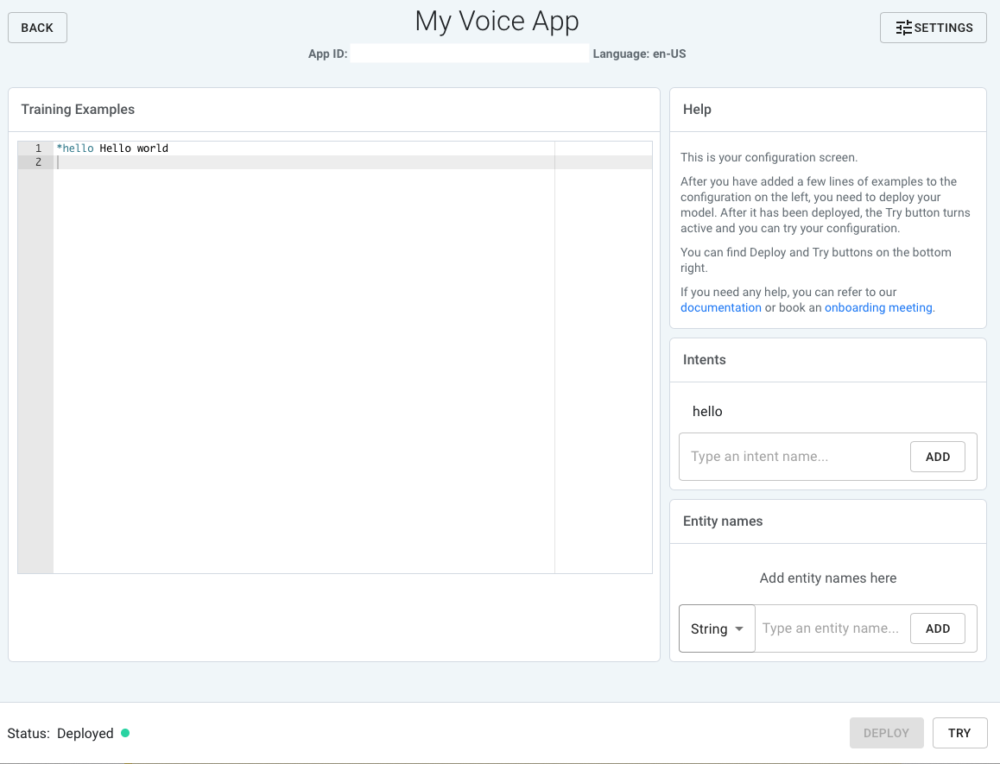

# Get started with Speechly

This tutorial will help you to get up and running with Speechly by guiding you through the process of building a simple voice filtering web app with Speechly and React.

Prerequisites:

Since we'll be using [create-react-app](https://create-react-app.dev/docs/getting-started) for this tutorial, we'll need the following tools:

* Node.js 8.10+
* npm 5.2+

Note that this tutorial also uses TypeScript, so feel free to check out [TypeScript documentation](https://www.typescriptlang.org/docs) if you're not familiar with it.

## 1. Creating an app

Let's get started by creating an app and installing its dependencies:
```sh
npx create-react-app speechly-voice-filter --typescript
cd speechly-voice-filter
npm i
```

Now that you've created the app, you can check it out by running `npm start` - it should open a browser tab with your app running in it.

## 2. Adding data and layout

Since we are building a filtering app, let's add some data to filter and layout to display it.

To make it simple, our data source will be just a static array with some popular repositories on GitHub. Let's add the following code and save it as `src/data.ts`:
```ts
export type Repository = {
  name: string;
  description: string;
  language: string;
  followers: number;
  stars: number;
  forks: number;
};

export const repositories: Repository[] = [
  {
    name: "microsoft/typescript",
    description:
      "TypeScript is a superset of JavaScript that compiles to clean JavaScript output",
    language: "TypeScript",
    followers: 2200,
    stars: 65000,
    forks: 8700,
  },
  {
    name: "nestjs/nest",
    description:
      "A progressive Node.js framework for building efficient, scalable, and enterprise-grade server-side applications on top of TypeScript & JavaScript (ES6, ES7, ES8)",
    language: "TypeScript",
    followers: 648,
    stars: 30900,
    forks: 2800,
  },
  {
    name: "microsoft/vscode",
    description: "Visual Studio Code",
    language: "TypeScript",
    followers: 3000,
    stars: 105000,
    forks: 16700,
  },
  {
    name: "denoland/deno",
    description: "A secure JavaScript and TypeScript runtime",
    language: "TypeScript",
    followers: 1700,
    stars: 68000,
    forks: 3500,
  },
  {
    name: "kubernetes/kubernetes",
    description: "Production-Grade Container Scheduling and Management",
    language: "Go",
    followers: 3300,
    stars: 70700,
    forks: 25500,
  },
  {
    name: "moby/moby",
    description:
      "Moby Project - a collaborative project for the container ecosystem to assemble container-based systems",
    language: "Go",
    followers: 3200,
    stars: 58600,
    forks: 16900,
  },
  {
    name: "gohugoio/hugo",
    description: "The world’s fastest framework for building websites",
    language: "Go",
    followers: 1000,
    stars: 47200,
    forks: 5400,
  },
  {
    name: "grafana/grafana",
    description:
      "The tool for beautiful monitoring and metric analytics & dashboards for Graphite, InfluxDB & Prometheus & More",
    language: "Go",
    followers: 1300,
    stars: 37500,
    forks: 7600,
  },
  {
    name: "pytorch/pytorch",
    description:
      "Tensors and Dynamic neural networks in Python with strong GPU acceleration",
    language: "Python",
    followers: 1600,
    stars: 43000,
    forks: 11200,
  },
  {
    name: "tensorflow/tensorflow",
    description: "An Open Source Machine Learning Framework for Everyone",
    language: "Python",
    followers: 8300,
    stars: 149000,
    forks: 82900,
  },
  {
    name: "django/django",
    description: "The Web framework for perfectionists with deadlines",
    language: "Python",
    followers: 2300,
    stars: 52800,
    forks: 22800,
  },
  {
    name: "apache/airflow",
    description:
      "Apache Airflow - A platform to programmatically author, schedule, and monitor workflows",
    language: "Python",
    followers: 716,
    stars: 18500,
    forks: 7200,
  },
];
```

We can display this data in a simple table, so let's add a component for that under `src/RepoList.tsx`:
```tsx
import React from "react";

import { Repository } from "./data";

type Props = {
  repos: Repository[];
};

export const RepoList = React.memo(
  ({ repos }: Props): JSX.Element => {
    return (
      <div>
        <table>
          <thead>
            <tr>
              <th>Name</th>
              <th>Language</th>
              <th>Description</th>
              <th>Followers</th>
              <th>Stars</th>
              <th>Forks</th>
            </tr>
          </thead>
          <tbody>
            {repos.map((repo) => (
              <RepoRow repo={repo} key={repo.name} />
            ))}
          </tbody>
        </table>
      </div>
    );
  }
);

const RepoRow = React.memo(
  ({ repo }: { repo: Repository }): JSX.Element => {
    return (
      <tr>
        <td>{repo.name}</td>
        <td>{repo.language}</td>
        <td>{repo.description}</td>
        <td>{repo.followers}</td>
        <td>{repo.stars}</td>
        <td>{repo.forks}</td>
      </tr>
    );
  }
);
```

In order to show the table, we'll need to render it. We could render our table right in our top-level `App` component, but let's instead use a top-level component for our app under `src/SpeechApp.tsx`, it will come in handy later on:
```tsx
import React from "react";

import { repositories } from "./data";

import { RepoList } from "./RepoList";

export const SpeechApp: React.FC = (): JSX.Element => {
  return (
    <div>
      <RepoList repos={repositories} />
    </div>
  );
};
```

Now let's add it to our top-level component:
```tsx
import React from "react";
import { SpeechProvider } from "@speechly/react-client";

import "./App.css";

import { SpeechApp } from "./SpeechApp";

function App(): JSX.Element {
  return (
    <div className="App">
      <SpeechApp />
    </div>
  );
}

export default App;
```

## 3. Adding Speechly client and a microphone button

Before we proceed with the app, let's take a quick detour and train a very simple and not very useful Speechly app, so that we can use it to test our integration later on.

Go to https://speechly.com/dashboard and login (or sign up if you haven't yet) and create a new app (you can [check our Speechly Dashboard quickstart guide](https://www.speechly.com/docs/quick-start/) if you feel lost). Feel free to use any configuration you want, even an almost empty configuration with just a "Hello world" will suffice, but make sure your app is deployed!



Once you have your Speechly app deployed, let's integrate it. Start by installing Speechly React client:
```sh
npm i --save @speechly/react-client
```

The client exposes a context provider and a hook that allows you to consume that context. Let's add the context provider to `src/App.tsx` - make sure you provide the `App ID` of your Speechly app as a property for `SpeechProvider`!
```tsx
import React from "react";
import { SpeechProvider } from "@speechly/react-client";

import "./App.css";

function App(): JSX.Element {
  return (
    <div className="App">
      <SpeechProvider appId="your-app-id-here" language="en-US">
        <SpeechApp />
      </SpeechProvider>
    </div>
  );
}

export default App;
```

Next let's add some code to act as the microphone button. Also, it would be nice to see what we are saying, so let's also render the transcript next to the button for some feedback. Let's make that a separate component and save it as `src/Microphone.tsx`:
```tsx
import React from "react";
import {
  Word as SpeechWord,
  SpeechSegment,
  SpeechState,
} from "@speechly/react-client";

type Props = {
  segment?: SpeechSegment;
  state: SpeechState;
  onRecord: () => Promise<void>;
};

export const Microphone = React.memo(
  ({ state, segment, onRecord }: Props): JSX.Element => {
    let enabled = false;
    let text = "Error";

    switch (state) {
      case SpeechState.Idle:
      case SpeechState.Ready:
        enabled = true;
        text = "Start";
        break;
      case SpeechState.Recording:
        enabled = true;
        text = "Stop";
        break;
      case SpeechState.Connecting:
      case SpeechState.Loading:
        enabled = false;
        text = "Loading...";
        break;
    }

    return (
      <div>
        <button onClick={onRecord} disabled={!enabled}>
          {text}
        </button>
        <Transcript segment={segment} />
      </div>
    );
  }
);

const Transcript = React.memo(
  ({ segment }: { segment?: SpeechSegment }): JSX.Element => {
    if (segment === undefined) {
      return (
        <div>
          <em>Waiting for speech input...</em>
        </div>
      );
    }

    return (
      <div>
        {segment.words.map((w) => (
          <Word word={w} key={w.index} />
        ))}
      </div>
    );
  }
);

const Word = React.memo(
  ({ word }: { word: SpeechWord }): JSX.Element => {
    if (word.isFinal) {
      return <strong>{`${word.value} `}</strong>;
    }

    return <span>{`${word.value} `}</span>;
  }
);
```

One more step - we'd need to render our component and hook it up to the API. Let's add it to our `SpeechApp` component:
```tsx
import React from "react";
import { useSpeechContext } from "@speechly/react-client";

import { repositories } from "./data";

import { RepoList } from "./RepoList";
import { Microphone } from "./Microphone";

export const SpeechApp: React.FC = (): JSX.Element => {
  const { toggleRecording, speechState, segment } = useSpeechContext();

  return (
    <div>
      <Microphone
        segment={segment}
        state={speechState}
        onRecord={toggleRecording}
      />
      <RepoList repos={repositories} />
    </div>
  );
};
```

Now you can go ahead and try talking to the app and see what you get back in the transcript. Congratulations, you've just integrated Speechly into the app.

However, we still need to implement the filtering functionality.

## 4. Configuring Speechly app

Now that we've integrated the API into the app it's time to make our Speechly app useful. Let's add a couple of simple commands for manipulating the data we see in the table:

* A command to filter by programming language, e.g. when a user says "Show me TypeScript repos" the app will only show repos with that specific language
* A command to sort the results in a specific order, e.g. "Sort the results by forks" will sort the repos by the amount of forks it has.
* A command to reset the filters, e.g. "Reset the filters to default" will remove the language filter and reset the sorting to some default.

Let's go back to [Speechly dashboard](https://speechly.com/dashboard) and update the configuration of our app with the following:
```
# Which languages we can filter by
languages = [
  Go
  TypeScript
  Python
]

# Which fields we can sort by
sort_fields = [
  name
  description
  language
  followers
  stars
  forks
]

# Synonyms for "repo"
results = [
  items
  results
  repos
  repositories
]

# A couple of commands for filtering.
#
# This will expand into e.g. following examples (not exhaustive):
# "Show all Go repos"
# "Show me only TypeScript repositories"
# "Show Python results"
# etc.
#
# Words in curly brackets ("{me}") are optional.
# Square brackets are for lists (e.g. one option from the list may be used)
*filter show {me} {[all | only]} $languages(language) {$results}
*filter filter {$results} by $languages(language) {language}

# A command for sorting, e.g.:
# "Sort the repos by name"
# "Order results by forks"
# etc.
*sort [sort | order] {the} {$results} by $sort_fields(sort_field)

# A command for resetting the filters, e.g.:
# "Reset all filters to default"
# "Remove the filters"
# "Reset to default"
# etc.
*reset [reset | remove] {[the | all]} {filters} {to default}
```
Don't forget to add `sort`, `filter` and `reset` as intents and `languages` and `sort_fields` as entities. You can also read more about how to configure your Speechly application [in our documentation](https://www.speechly.com/docs/slu-examples/).

Once you've deployed your new version of the Speechly app, let's continue to parsing the results.

## 5. Parsing intents and entities

Now that we've trained a version of Speechly app with proper entities and intents, let's parse the results.

We want to parse the segment that is returned by `useSpeechContext`, which contains entities and intents returned from the API, so let's use a hook for that in our `SpeechApp`:
```tsx
import React, { useEffect } from "react";
import { SpeechSegment, useSpeechContext } from "@speechly/react-client";

import { repositories } from "./data";
import {
  IntentType,
  SortEntityType,
  parseIntent,
  parseLanguageEntity,
  parseSortEntity,
} from "./parser";

import { RepoList } from "./RepoList";
import { Microphone } from "./Microphone";

export const SpeechApp: React.FC = (): JSX.Element => {
  const { toggleRecording, speechState, segment } = useSpeechContext();

  useEffect(() => {
    if (segment === undefined) {
      return;
    }

    parseSegment(segment);
  }, [segment]);

  return (
    <div>
      <Microphone
        segment={segment}
        state={speechState}
        onRecord={toggleRecording}
      />
      <RepoList repos={repositories} />
    </div>
  );
};

function parseSegment(segment: SpeechSegment) {
  const intent = parseIntent(segment);

  switch (intent) {
    case IntentType.Filter:
      const languages = parseLanguageEntity(segment);
      console.log("Filtering by languages", languages);
      break;
    case IntentType.Sort:
      const sortBy = parseSortEntity(segment);
      if (sortBy !== SortEntityType.Unknown) {
        console.log("Sorting by field", sortBy);
      }
      break;
    case IntentType.Reset:
      console.log("Resetting the filters");
      break;
  }
}
```

But we're also importing some code from `parser`, which we haven't added yet, so let's do that - add the following code to `src/parser.ts`:
```ts
import { SpeechSegment } from "@speechly/react-client";

export enum IntentType {
  Unknown = "unknown",
  Sort = "sort",
  Filter = "filter",
  Reset = "reset",
}

export enum EntityType {
  Language = "language",
  SortField = "sort_field",
}

export enum SortEntityType {
  Unknown = "unknown",
  Name = "name",
  Description = "description",
  Language = "language",
  Followers = "followers",
  Stars = "stars",
  Forks = "forks",
}

const SpeechIntentValues = Object.values(IntentType) as string[];
const SortTypeValues = Object.values(SortEntityType) as string[];

export function parseIntent(segment: SpeechSegment): IntentType {
  const { intent } = segment;

  if (SpeechIntentValues.includes(intent.intent)) {
    return intent.intent as IntentType;
  }

  return IntentType.Unknown;
}

export function parseLanguageEntity(segment: SpeechSegment): string[] {
  const langs: string[] = [];

  for (const e of segment.entities) {
    if (e.type === EntityType.Language) {
      langs.push(e.value.toLowerCase());
    }
  }

  return langs;
}

export function parseSortEntity(segment: SpeechSegment): SortEntityType {
  let s = SortEntityType.Unknown;

  for (const e of segment.entities) {
    const val = e.value.toLowerCase();

    if (e.type === EntityType.SortField && SortTypeValues.includes(val)) {
      s = val as SortEntityType;
    }
  }

  return s;
}
```

Now every time we get a new `segment` from the client, we're going to parse our sorting and filtering entities out of it. Right now we are just logging them, but to use them we'll have to add some filters, so let's continue with that.

## 6. Adding and applying filters

In order to apply filters, we'd need to implement some filtering logic, so let's do just that and add it as `src/filter.ts`:
```ts
import { Repository } from "./data";
import { SortEntityType } from "./parser";

export type Filter = {
  languages?: string[];
  sortBy?: SortEntityType;
};

export function filterRepos(
  input: Repository[],
  filters: Filter
): Repository[] {
  let output = input;

  const languages = filters.languages ?? [];
  if (languages.length > 0) {
    output = input.filter((repo) =>
      languages.includes(repo.language.toLowerCase())
    );
  }

  if (filters.sortBy === undefined) {
    return output;
  }

  return output.sort((left, right) => {
    switch (filters.sortBy) {
      case SortEntityType.Name:
        return left.name.localeCompare(right.name);
      case SortEntityType.Description:
        return left.description.localeCompare(right.description);
      case SortEntityType.Language:
        return left.language.localeCompare(right.language);
      case SortEntityType.Followers:
        return compareNumber(left.followers, right.followers);
      case SortEntityType.Stars:
        return compareNumber(left.stars, right.stars);
      case SortEntityType.Forks:
        return compareNumber(left.forks, right.forks);
    }

    return 0;
  });
}

function compareNumber(left: number, right: number) {
  if (left < right) {
    return -1;
  }

  if (left > right) {
    return 1;
  }

  return 0;
}
```

But we also need to call the filtering function when we get new results from the API, so let's also update our `SpeechApp` to do that:
```tsx
import React, { useEffect, useState } from "react";
import { SpeechSegment, useSpeechContext } from "@speechly/react-client";

import { repositories, Repository } from "./data";
import { Filter, filterRepos } from "./filter";
import {
  IntentType,
  SortEntityType,
  parseIntent,
  parseLanguageEntity,
  parseSortEntity,
} from "./parser";

import { RepoList } from "./RepoList";
import { Microphone } from "./Microphone";

export const SpeechApp: React.FC = (): JSX.Element => {
  const [filter, setFilter] = useState<Filter>(defaultFilter);
  const [repos, setRepos] = useState<Repository[]>(
    filterRepos(repositories, defaultFilter)
  );

  const { toggleRecording, speechState, segment } = useSpeechContext();

  useEffect(() => {
    if (segment === undefined) {
      return;
    }

    const nextFilter = {
      ...filter,
      ...parseSegment(segment),
    };

    setFilter(nextFilter);
    setRepos(filterRepos(repositories, filter));
  }, [segment]);

  return (
    <div>
      <Microphone
        segment={segment}
        state={speechState}
        onRecord={toggleRecording}
      />
      <RepoList repos={repos} />
    </div>
  );
};

const emptyFilter: Filter = {};
const defaultFilter: Filter = {
  languages: [],
  sortBy: SortEntityType.Name,
};

function parseSegment(segment: SpeechSegment): Filter {
  const intent = parseIntent(segment);

  switch (intent) {
    case IntentType.Filter:
      const languages = parseLanguageEntity(segment);

      if (languages.length === 0) {
        return emptyFilter;
      }

      return {
        languages,
      };
    case IntentType.Sort:
      const sortBy = parseSortEntity(segment);
      if (sortBy !== SortEntityType.Unknown) {
        return {
          sortBy,
        };
      }

      return emptyFilter;
    case IntentType.Reset:
      return defaultFilter;
    default:
      return emptyFilter;
  }
}
```

And that's it! Now you can go ahead and try it out yourself - you can filter the repos by language, apply some sorting order and reset the filters.

If you want to delve into the details, go ahead and check out [our documentation](https://speechly.com/docs) and [our public GitHub](https://github.com/speechly).

You can also check the source code for this tutorial at https://github.com/speechly/react-example-repo-filtering. Feel free to navigate through individual commits - they refer to each section of this tutorial.
